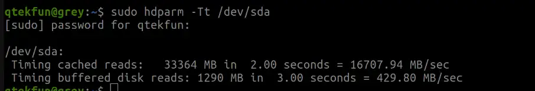
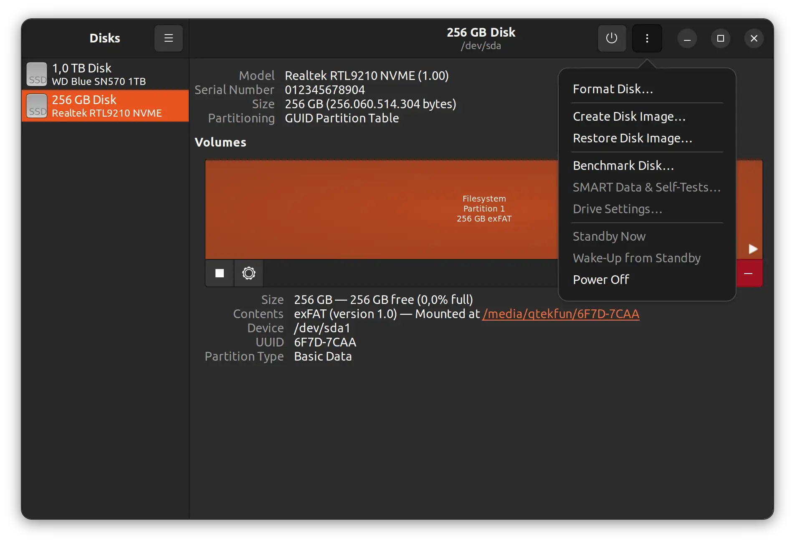
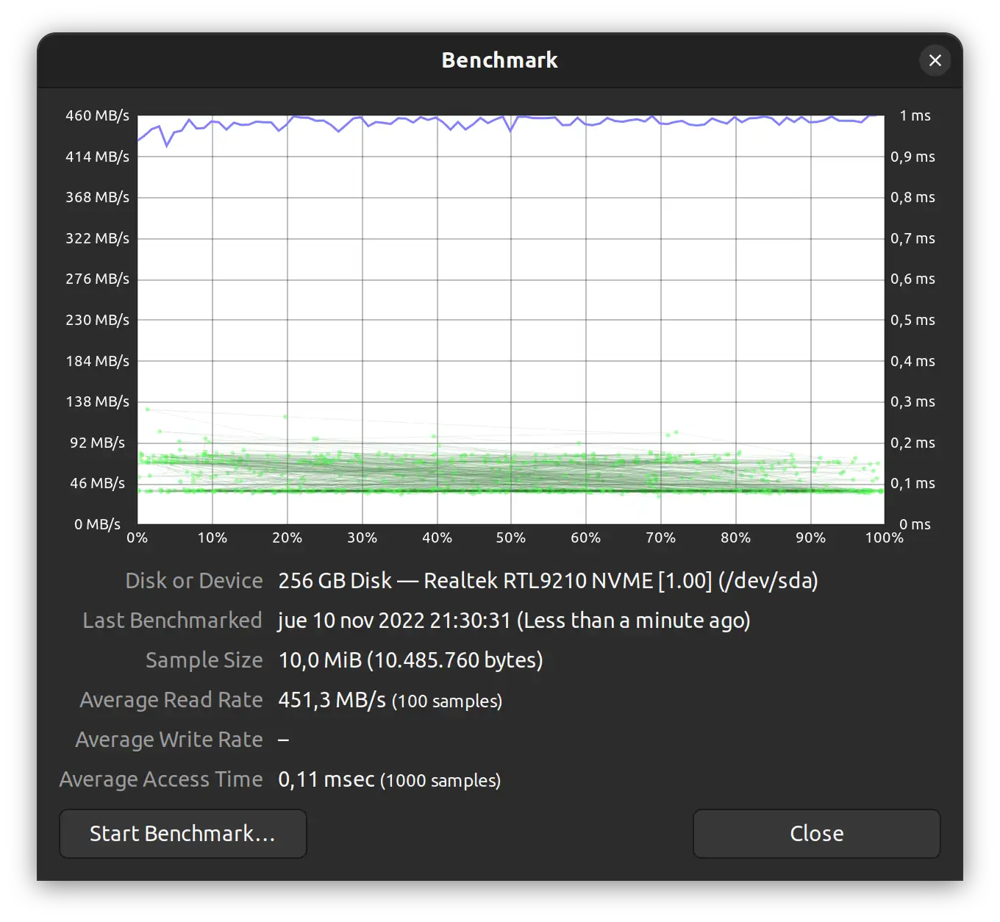

Esta es una nota rápida. Hoy me he comprado una caja usb para un disco m2 nvme y quería comprobar su velocidad ya que dice ser gigabit. Y aunque del disco desconozco sus prestaciones, algo queria probar. Así que googleando he estado buscando y esto es lo que he encontrado.

## Hdparm: benchmark facil para ssd en linux
Pues desconocía esta app, pero resulta que en Ubuntu 22.10 viene incluida. Su uso, el que sigue `sudo hdparm -Tt /dev/sda` y os dará un output como el siguiente:

## Con ventana: "Discos"

Si no sois de terminal (no sé que haceis usando linux) teneis la opción de abrir la app de **Discos** ("Disks" si lo teneis en Inglés). Con arrancarla, seleccionar el disco y darle a los tres puntos vereis la opción de hacer un *benchmark* (o prueba de rencimiento).

Dejais los valores por defecto, le dais a ejecutar y listo, tendreis algo como esto:

Con esto espero que os sea suficiente.