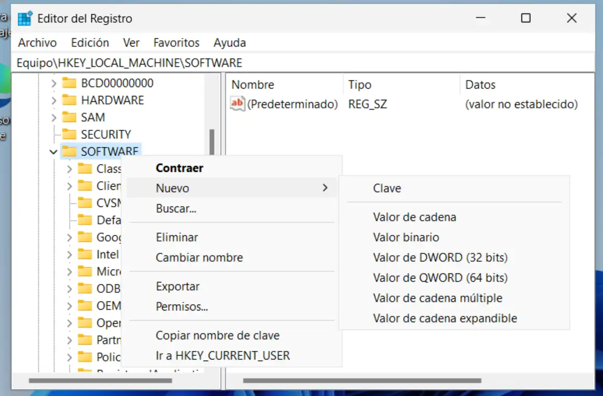
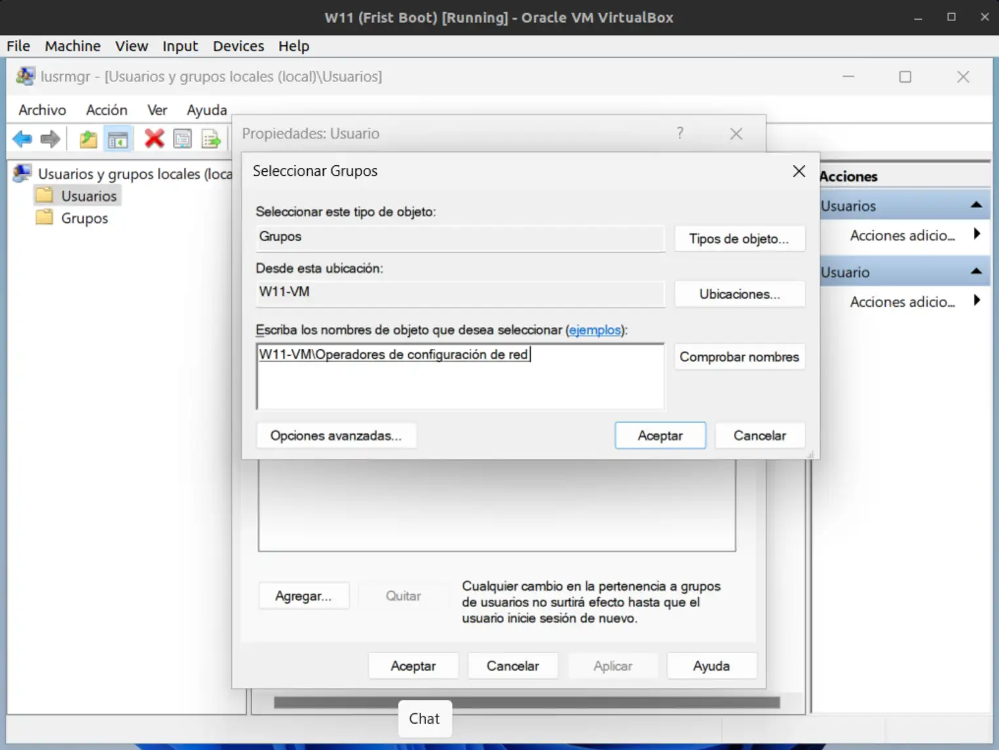

Si llegas a este post es porque quieres usar Wireguard en un equipo pero no eres usuario administrador, o quieres que alguien lo use siendo tu el administrador. Pues te cuento todo lo que sé y cómo hacerlo.

## Limitaciones de usar Wireguard no siendo administrador
Básicamente no ser admin te limita a activar y desactivar conexiones pero no vas a poder configurar ninguna nueva conexión VPN. Esto debe de hacerlo un usuario administrador del equipo o dominio.

## ¿Cómo hacemos que Wireguard funcione para un usuario no admin?
Básicamente el proceso son 3 pasos y un reinicio.

### Paso 1: Configura las conexiones como usuario administrador
Desde la cuenta admin, importa las configuraciones de todas las conexiones VPN que necesites

### Paso 2: Habilitalo en el registro de Windows
1. Añade una clave en `HKLM\Software\WireGuard`
2. Pulsando en la ventana de la derecha con *click derecho > Nuevo > Valor de DWORD (32 bits)*
3. Le ponemos por nombre `LimitedOperatorUI`
4. Le damos el valor de `1`
> Nota: HKLM es el acronimo de `HKEY_LOCAL_MACHINE`

### Paso 3: Configurar el usuario
Tenemos que ir a *Usuarios y grupos locales*. 

1. Para ello lo mejor es escribir `lusrmgr.msc` en inicio y abrirlo en modo administrador.
2. Abrimos usuarios y buscamos el usuario no admin que va a ejecutar wireguard.
3. Seleccionando dicho usuario pulsamos boton derecho y *Propiedades*
4. Vamos a la pestaña *Miembro de* y seleccionamos *Agregar...* (debajo del cuadro blanco)

5. Escribimos el nombre de grupo *Operadores de configuración de red* y pulsamos en comprobar nombres. Esto añade en el cuadro blanco un nombre de máquina o dominio.
6. Aceptamos y reiniciamos la maquina.

Y esto es todo. Al reinciar, todo deberia ir como la seda y el usuario no admin estár funcionando.
